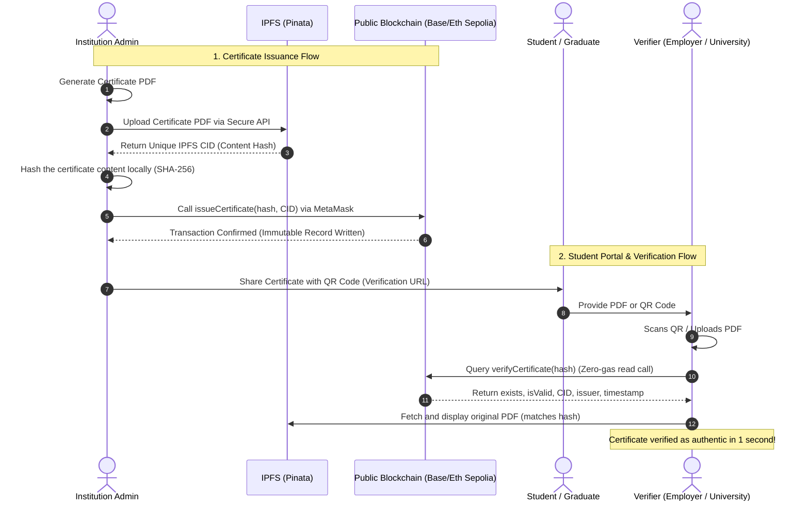

# 🛡️ Verity — Blockchain Certificate Verification Platform

Verity is a secure, decentralized, and institution-grade platform designed to issue, manage, and verify academic and professional certificates. By anchoring document credentials directly onto a public blockchain (L2 / Ethereum Sepolia) and hosting the source documents permanently on **IPFS**, Verity makes document forgery mathematically impossible and verification instant.

---

## 🌐 Industry-Ready Workflow

Verity operates as a zero-trust verification system, combining local hashing, decentralized storage, and a public ledger:



---

## 🔒 Cryptographic Security Architecture (Anti-Forgery FAQs)

### ❓ What is the role of the QR code?
The QR code is a visual shortcut designed to make verification instant. 
* Instead of requiring an employer to navigate to the Verity portal, copy a long 64-character SHA-256 hash, and paste it manually, they simply scan the QR code.
* The QR code automatically resolves to: `https://verity.domain.com/verify?hash=0xYOUR_HASH`.
* The portal reads the hash parameter from the URL and **instantly displays** the live, on-chain authenticity result.

### ❓ If a student changes the text on the PDF but leaves the QR code unchanged, can they bypass security?
**Absolutely not.** This is the core strength of Verity's two-layered security system:

1. **The Visual Comparison Proof (If they scan the QR):**
   When the employer scans the original QR code, it opens the verification portal for the *original*, un-edited document hash. The blockchain will return **Valid**, but it will also pull the **original, un-edited PDF directly from IPFS** and display it side-by-side. The employer will immediately see the grade mismatch (e.g., Grade "C" on IPFS vs Grade "A" on the forged PDF).
2. **The Cryptographic Hash Proof (If they upload the PDF):**
   If the employer uploads the student's edited PDF directly onto the portal, the portal calculates the SHA-256 hash of the uploaded file locally. Because even a single letter, number, or pixel was altered, the resulting hash changes completely (known as the avalanche effect). The blockchain will return **Invalid / Certificate Not Found**, exposing the forgery instantly.

---

## 🛠️ Technology Stack

* **Smart Contracts:** Solidity `^0.8.24` (anchoring hashes, managing admins, handling revocations)
* **Development Network:** Hardhat (compilation, testing, local node)
* **Frontend Framework:** Next.js `16.2.6` (React, optimized static routing, modern light-trust theme)
* **Wallet Connection:** Ethers.js `v6` & MetaMask (Web3 standard)
* **Decentralized Storage:** IPFS via Pinata API (immutable, permanent file hosting)

---

## 🚀 Local Development Setup

To run Verity completely locally on your computer:

### 1. Start the Local Blockchain Node
```bash
cd blockchain
npm install
npm run node
```
This runs a local Hardhat Ethereum node at `http://127.0.0.1:8545` and prints 20 pre-funded test accounts.

### 2. Compile and Deploy the Smart Contract
Open a second terminal window:
```bash
cd blockchain
npm run compile
npm run deploy
```
This deploys the smart contract locally and automatically writes the deployed contract address into the frontend directory config (`deployed-address.json`).

### 3. Start the Next.js Frontend
```bash
cd frontend
npm install
npm run dev
```
Open **`http://localhost:3000`** in your browser to interact with Verity!

---

## ☁️ Public Production Deployment (Vercel & Sepolia)

To deploy Verity live to the public for free:

### 1. Configure Local Keys
Create a `.env.local` inside `frontend/` and a `.env` inside `blockchain/`:
```env
# In frontend/.env.local:
PINATA_API_KEY=your_pinata_key
PINATA_API_SECRET=your_pinata_secret

# In blockchain/.env:
DEPLOYER_PRIVATE_KEY=your_metamask_deployer_key
SEPOLIA_RPC_URL=https://ethereum-sepolia-rpc.publicnode.com
```

### 2. Deploy Smart Contract to Ethereum Sepolia Testnet
```bash
cd blockchain
npm run deploy:sepolia
```
This deploys the smart contract to the live public Ethereum Sepolia network and updates the address.

### 3. Host Next.js on Vercel
1. Securely commit and push your code to your private/public GitHub repository (`git push`). *Sensitive keys are safely hidden by `.gitignore`.*
2. Create a free Hobby project on **[Vercel](https://vercel.com/)** and import your repository.
3. Select `frontend` as the **Root Directory**.
4. Configure these **Environment Variables** securely on the Vercel dashboard:
   * `PINATA_API_KEY` = `your_pinata_key`
   * `PINATA_API_SECRET` = `your_pinata_secret`
   * `NEXT_PUBLIC_CONTRACT_ADDRESS` = `your_deployed_sepolia_address`
   * `NEXT_PUBLIC_RPC_URL` = `https://ethereum-sepolia-rpc.publicnode.com`
   * `NEXT_PUBLIC_CHAIN_ID` = `0xaa36a7` (Sepolia chain ID in hex)
5. Click **Deploy** and your live platform is ready for public use!
